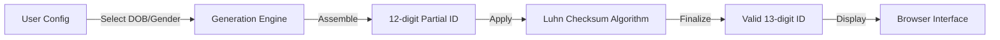

# 🏛️ KIROV DYNAMICS | SA ID NUMBER GENERATOR

> **"Sovereign Data Utilities for the African Digital Economy."**

---

## 📖 Overview

**SA ID Number Generator** is a lightweight, zero-dependency utility for generating structurally valid South African ID numbers. Built for developers and QA engineers, it enables rapid testing of ID-validation logic with high-fidelity, privacy-safe data.

---

## 🏗️ System Logic & Flow

The generator follows the official South African ID algorithm (Luhn's checksum).

---

## ✨ Features

- **🆔 Valid Format Generation**: Produces structurally valid 13-digit SA ID numbers using the Luhn algorithm.
- **🎂 Metadata Encoding**: Dynamically encodes Date of Birth, Gender, and Citizenship status.
- **⚡ Zero Overhead**: Lightweight Vanilla JS implementation with no external dependencies.
- **🔒 Privacy First**: Generates synthetic data for development use only, ensuring no PII exposure.

---

## 🚀 Live Demo

👉 **[Launch ID Generator Tool](https://chris927.github.io/generate-sa-idnumbers/)**

---

## 🤝 Collaboration & Credits

This tool is maintained in collaboration with the open-source community.

**Contributors:**
- [Chris927](https://github.com/Chris927) (Original Creator)
- [Raphasha27](https://github.com/Raphasha27) / Kirov Dynamics (Maintainer & Infrastructure)

---

## 📜 License
LGPL-3.0

---
*Maintained by Raphasha27 in collaboration with Chris927.*
